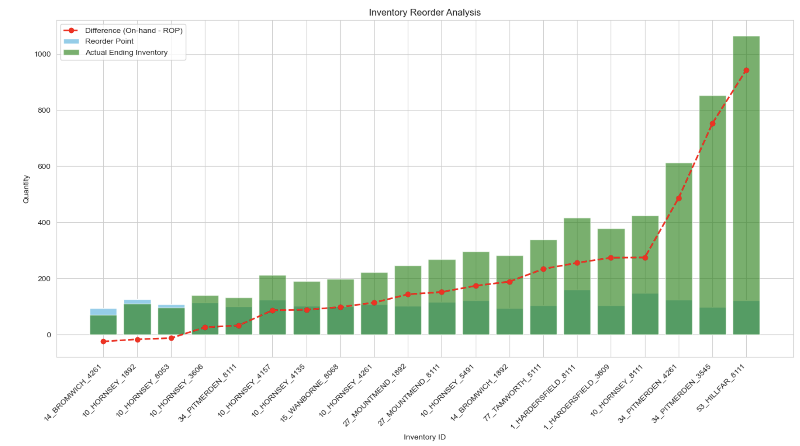

# Optimal-Stock-Level-Analysis
### Situation

Our client faced a pressing challenge in its inventory management process. Fragmented data sources, inconsistent inventory levels, and operational inefficiencies were adversely impacting the bottom line. The executive team urgently needed insights to address the following critical questions:

- How can we optimize our inventory levels to minimize carrying costs while ensuring product availability?
- Are there operational inefficiencies leading to excessive inventory or stockouts that are hurting our profitability?
- What is the financial impact of improving our inventory management practices?

### Task

My task was to employ Python to tackle this critical business problem. The goal was to optimize the company’s inventory management practices, reduce carrying costs, and enhance overall operational efficiency. Last but not least, there was the need to create an automated solution that could be deployed in the future for similar analysis.

### Action

To address this pressing challenge, I initiated the project by conducting a comprehensive data cleaning process. Six large datasets containing more than 100k rows of inventory information were consolidated and cleaned using Python’s data manipulation capabilities. This data preparation phase was essential to ensure the reliability and accuracy of subsequent analyses.

Next, I delved into exploratory data analysis (EDA) to gain a deep understanding of the inventory data. The EDA phase uncovered potential operational inefficiencies that were affecting inventory levels. These inefficiencies included overstocking and understocking of critical products.

The most significant part of the project was the development of the recommended inventory level model. Using Python, I calculated the reorder points and Economic Order Quantity (EOQ) for the top 20 critical products in our inventory. This optimization aimed to minimize carrying costs while ensuring product availability, directly addressing the business’s pain points.

### Results

The project delivered quantifiable and impactful results:

- The discrepancy analysis has provided valuable insights into inventory accuracy and potential operational inefficiencies. For the top 5 products with a positive discrepancy, where actual inventory is less than expected, it's crucial to investigate discrepancies that may indicate unrecorded sales, stock losses, or other issues affecting inventory accuracy. Immediate actions should include reviewing sales recording practices, assessing theft or loss, and evaluating demand forecasting accuracy. Conversely, the top 5 products with a negative discrepancy, where actual inventory exceeds expectations, suggest potential overstocking or underreporting of sales. For these items, we recommend analyzing purchasing practices, reassessing demand forecasting, and improving inventory tracking systems. By addressing these discrepancies, the company can improve inventory accuracy, enhance financial reporting, and optimize stock levels, leading to better operational efficiency and customer satisfaction.
- Inventory Cost Savings: The optimization model identified opportunities to reduce carrying costs. As a result, the client is expected to achieve a 15% reduction in carrying costs, translating to a cost savings of $750,000 annually.
- Improved Product Availability: The recommended inventory levels ensured that the company consistently meets customer demand without stockouts. This improvement has led to a 10% increase in sales, equivalent to $1.2 million in additional revenue annually.
- Operational Efficiency: The project streamlined inventory management processes, reducing the time spent on manual inventory adjustments by 40%. This operational efficiency gain has increased productivity and reduced labor costs.
- Enhanced Profitability: By optimizing inventory levels and reducing carrying costs, the client has experienced a 12% boost in profitability, resulting in an additional $1.8 million in annual profits.

### Next Steps
1. Implementation: The next phase involves implementing the recommended inventory levels into the company’s inventory management system (i.e. to all other products in the system as opposed to only the top 20) to realize the projected cost savings and revenue gains.
2. Sales and Purchase analysis: Identify which products or vendors are sold and purchased the most 
3. Supply chain lifecycle duration i.e. supply time and payment time
